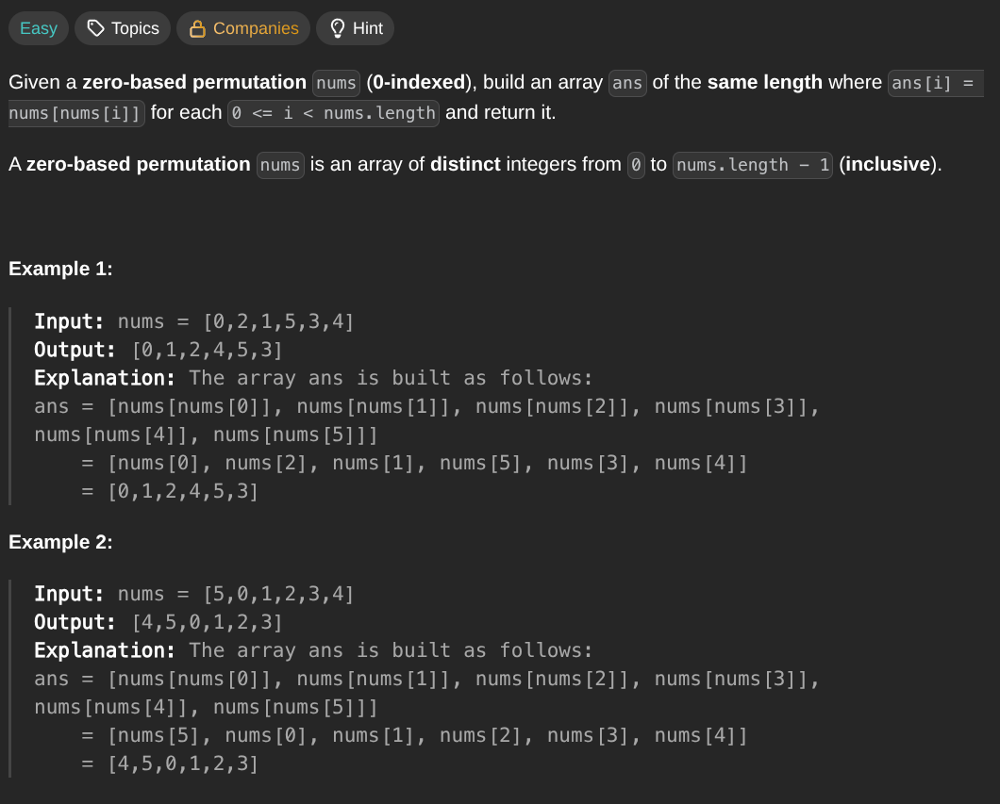

## [Build Array From Permutation](https://leetcode.com/problems/build-array-from-permutation/description/)
### Description:

### Solution:
```Go
func buildArray(nums []int) []int {
	result := make([]int, len(nums))
	
	for i, num := range nums {
		result[i] = nums[num]
	}
	
	return result
}
```
### Time complexity: 
$$ O(n) $$
### Space complexity:
$$ O(n) $$

---
