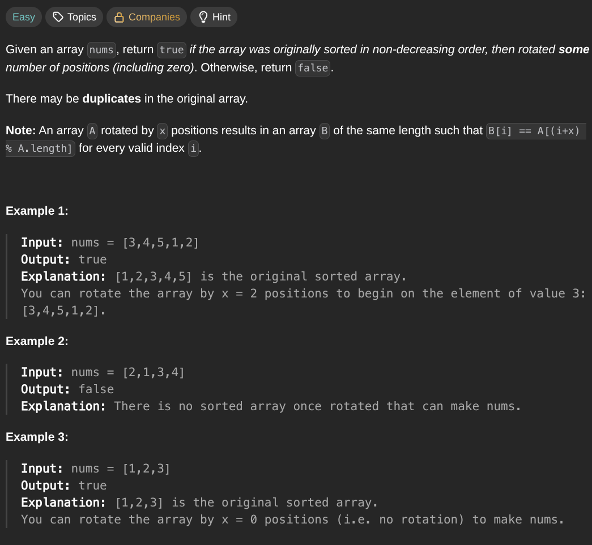

## [Check if Array Is Sorted and Rotated](https://leetcode.com/problems/check-if-array-is-sorted-and-rotated/description/)
### Description:

### Solution:
```Go
func check(nums []int) bool {
	result := 0
	
	for i := 0; i < len(nums); i++ {
		if nums[i] > nums[(i+1) % len(nums)] {
			result++
		}
	}
	
	return result <= 1
}
```
### Time complexity: 
$$ O(n) $$
### Space complexity:
$$ O(1) $$

---
