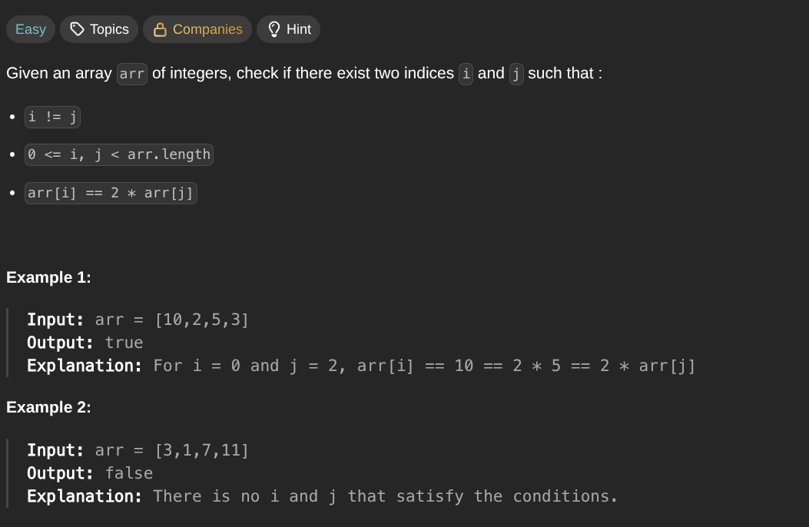

## [Check If N and Its Double Exist](https://leetcode.com/problems/checkIfNAndItsDoubleExist/description/)
### Description:

### Solution:
```Go
func checkIfExist(arr []int) bool {
	seen := make(map[int]int)
	
	for i, num := range arr {
		seen[num] = i
	}
	
	for i, num := range arr {
		if value, ok := seen[num*2]; ok && value != i {
			return true
		}
	}
	
	return false
}
```
### Time complexity: 
$$ O(n) $$
### Space complexity:
$$ O(n) $$

---
