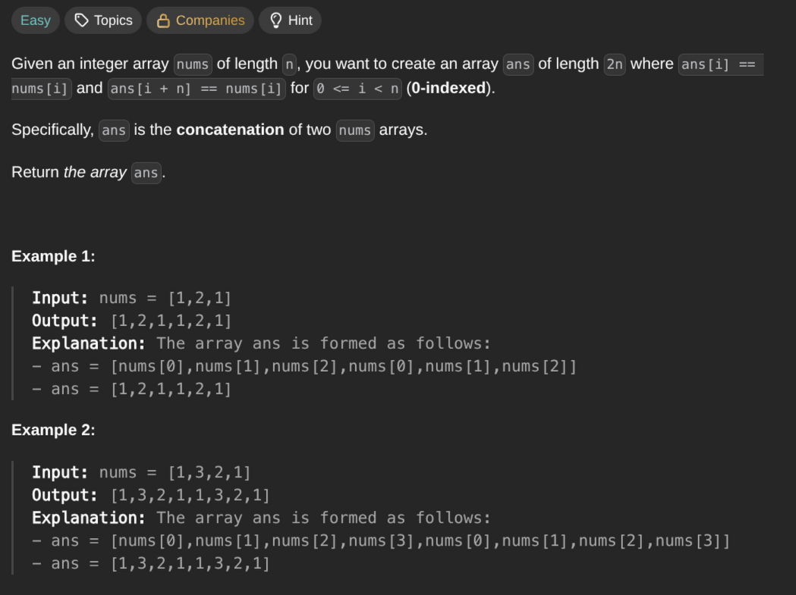

## [Concatenation of Array](https://leetcode.com/problems/concatenation-of-array/description/)
### Description:

### Solution:
```Go
func getConcatenation(nums []int) []int {
	result := make([]int, len(nums) * 2)
	
	for i := 0; i < len(nums); i++ {
		result[i] = nums[i]
		result[i + len(nums)] = nums[i]
	}
	
	return result
}
```
### Time complexity: 
$$ O(n) $$
### Space complexity:
$$ O(n) $$

---