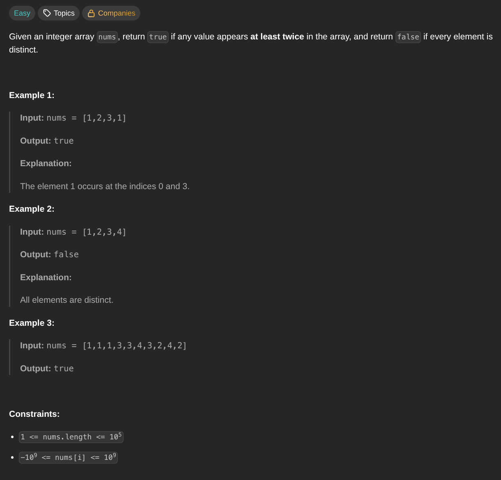

## [Contains Duplicate](https://leetcode.com/problems/contains-duplicate/description/)
### Description:

### Solution:
```Go
func containsDuplicate(nums []int) bool {
	seen := make(map[int]bool)
	
	for _, num := range nums {
		if _, ok := seen[num]; ok {
			return true
		}
		seen[num] = true
	}
	
	return false	
}
```
### Time complexity: 
$$ O(n) $$
### Space complexity:
$$ O(n) $$
---
