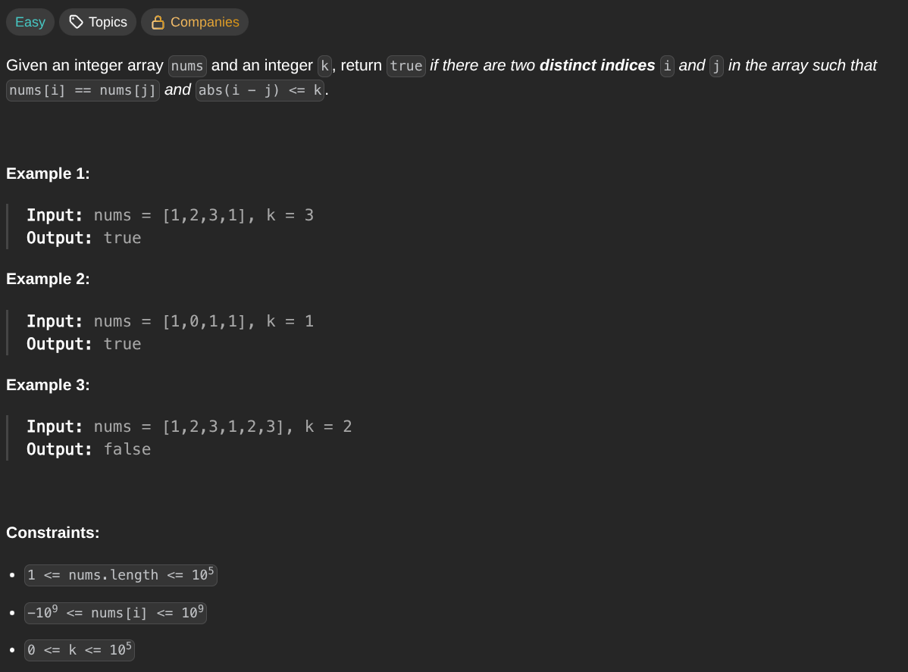

## [Contains Duplicate](https://leetcode.com/problems/contains-duplicate/description/)
### Description:

### Solution:
```Go
func containsNearbyDuplicate(nums []int, k int) bool {
	seen := make(map[int]int)
	
	for i, num := range nums {
		if value, ok := seen[num]; !ok {
			seen[num] = i
		} else {
			if i - value <= k {
				return true
			} else {
				seen[num] = i
			}
		}
	}
	
	return false
}
```
### Time complexity: 
$$ O(n) $$
### Space complexity:
$$ O(n) $$

---
