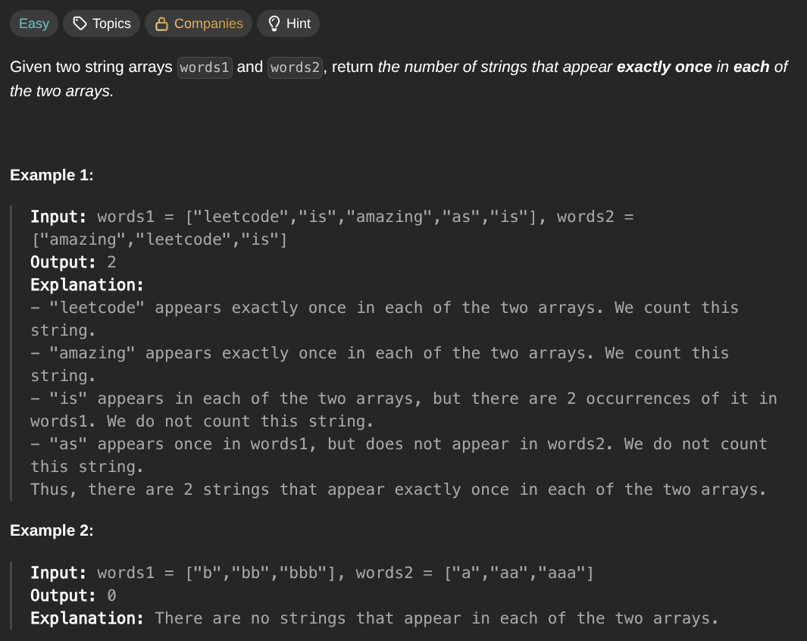

## [Count Common Words With One Occurrence](https://leetcode.com/problems/count-common-words-with-one-occurrence/description/)
### Description:

### Solution:
```Go
func countWords(words1, words2 []string) int {
	seen := make(map[string]int)
	result := 0
	
	for _, word := range words1 {
		seen[word]++
	}
	
	for _, word := range words2 {
		if value, ok := seen[word]; ok && value <= 1 {
			seen[word]--
		}
	}
	
	for _, value := range seen {
		if value == 0 {
			result++
		}
	}
	
	return result
}
```
### Time complexity: 
$$ O(n) $$
### Space complexity:
$$ O(n) $$

---