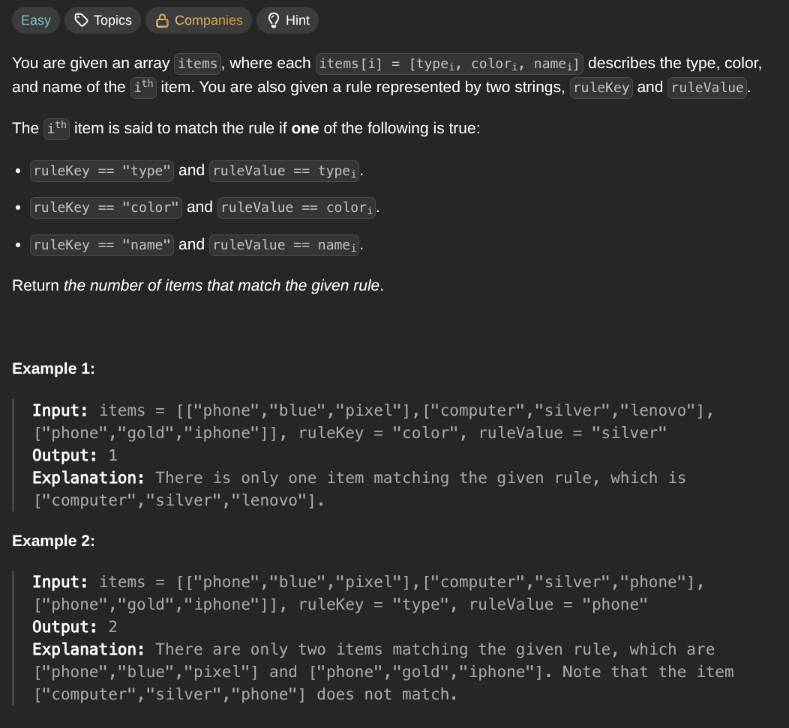

## [Count Items Matching a Rule](https://leetcode.com/problems/count-items-matching-a-rule/description/)
### Description:

### Solution:
```Go
fucn countMatches(items [][]string, ruleKey, ruleValue string) int {
	result := 0
	
	for _, item := range items {
		switch ruleKey {
			case "type":
				if item[0] == ruleValue { result++ }
			case "color":
				if item[1] == ruleValue { result++ }
			case "name":
				if item[2] == ruleValue { result++ }
		}
	}
	
	return result
}
```
### Time complexity: 
$$ O(n) $$
### Space complexity:
$$ O(1) $$

---
