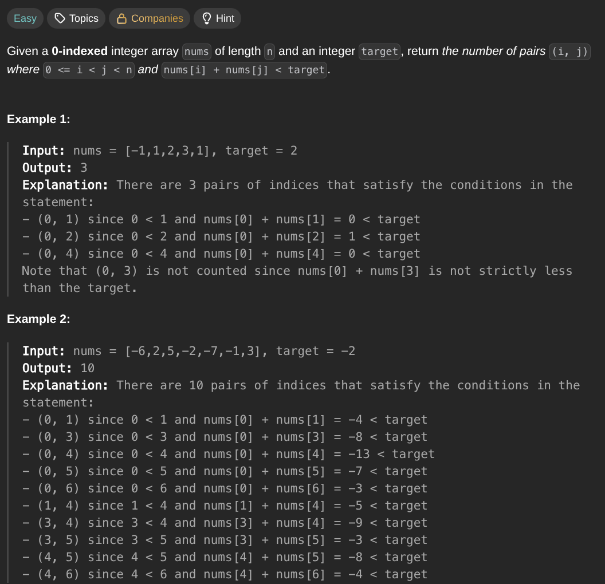

## [Count Pairs Whose Sum is Less than Target](https://leetcode.com/problems/count-pairs-whose-sum-is-less-than-target/description/)
### Description:

### Solution:
```Go
func countPairs(nums []int, target int) int {
	sort.Ints(nums)
	result := 0
	left, right := 0, len(nums) - 1
	for left < right {
		if nums[right] - nums[left] < target {
			result += right - left
			left++
		} else {
			right--
		}
	}
	
	return result
}
```
### Time complexity: 
$$ O(n \cdot log(n)) $$
### Space complexity:
$$ O(1) $$

---
