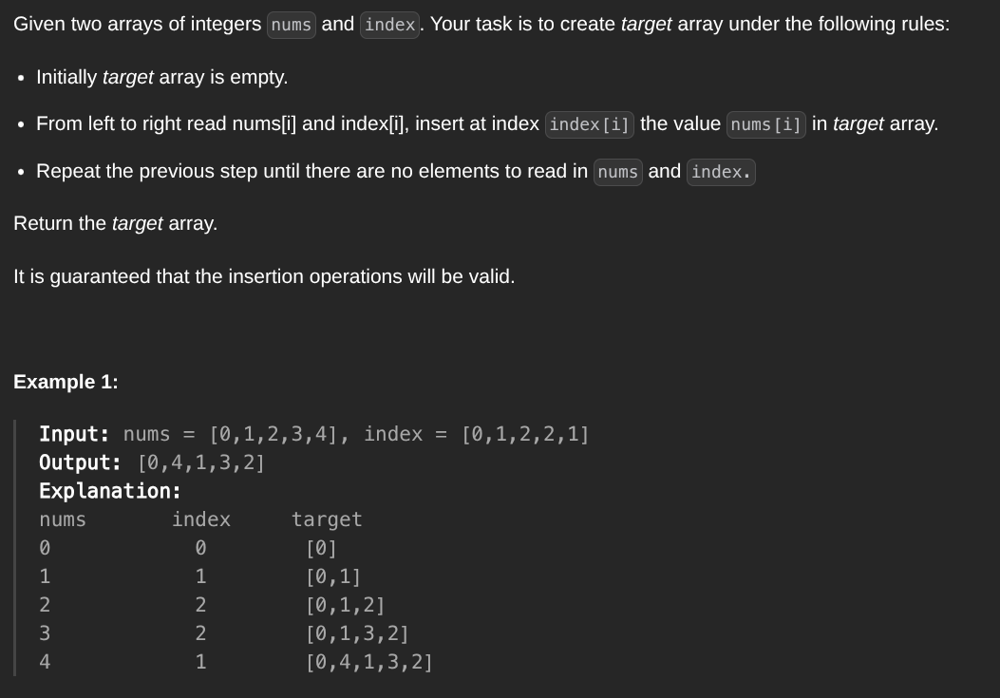

## [Create Target Array in the Given Order](https://leetcode.com/problems/create-target-array-in-the-giver-order/description/)
### Description:

### Solution:
```Go
func createTargetArray(nums, index []int) []int {
	result := make([]int, len(nums))
	
	for i := 0; i < len(nums); i++ {
		for j := i; j > index[i]; j-- {
			result[j] = result[j-1]
		}
		result[index[i]] = nums[i]
	}
	
	return result
}
```
### Time complexity: 
$$ O(n^2) $$
### Space complexity:
$$ O(n) $$

---
