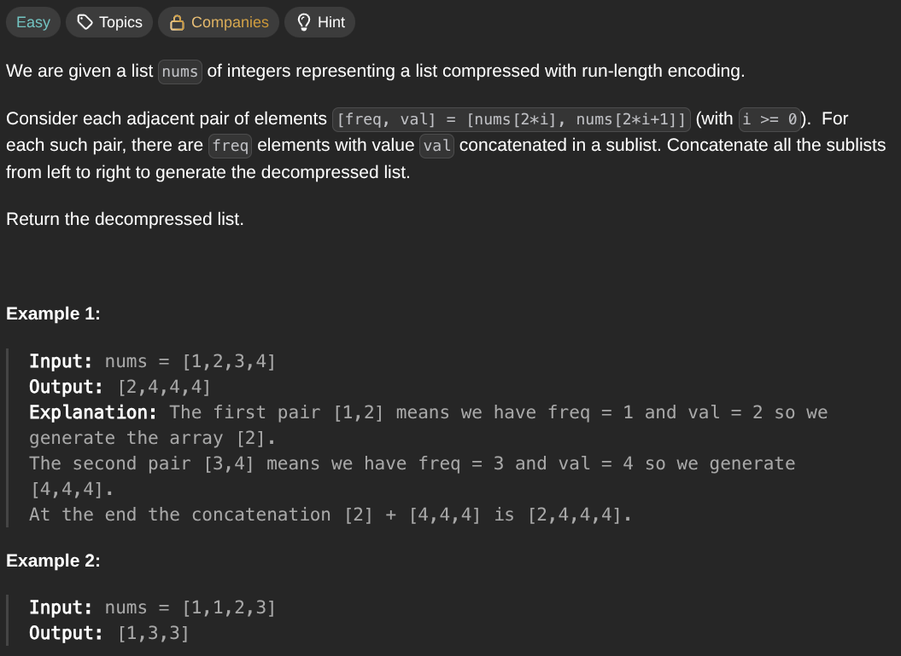

## [Decompress Run-Length Encoded List](https://leetcode.com/problems/decompress-run-length-encoded-list/description/)
### Description:

### Solution:
```Go
func decompressRLElist(nums []int) []int {
	result := make([]int, 0)
	
	for i := 0; i < len(nums); i += 2 {
		for j := 0; j < nums[i]; j++ {
			result = append(result, nums[i+1])
		}
	}
	
	return result
}
```
### Time complexity: 
$$ O(k); \space k \space - \space total \space frequently $$
### Space complexity:
$$ O(k); \space k \space - \space total \space frequently $$

---