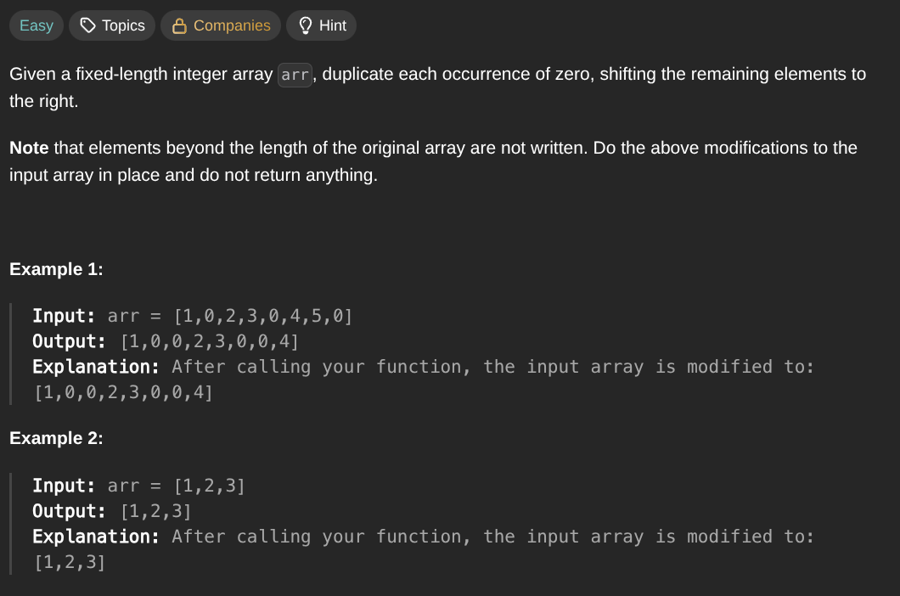

## [Duplicate Zeros](https://leetcode.com/problems/duplicate-zeros/description/)
### Description:

### Solution:
```Go
func duplicateZeros(arr []int) {
	zeros := 0
	
	for _, num := range arr {
		if num == 0 { zeros++ }
	}
	
	for i := len(arr)-1; i >= 0; i-- {
		if arr[i] == 0 {
			if i + zeros < len(arr) { arr[i + zeros] = 0 }
			if i + zeros - 1 < len(arr) { arr[i + zeros - 1] = 0 }
			zeros--
		} else if i + zeros < len(arr) {
			arr[i + zeros] = arr[i]
		}
	}
}
```
### Time complexity: 
$$ O(n) $$
### Space complexity:
$$ O(1) $$

---
