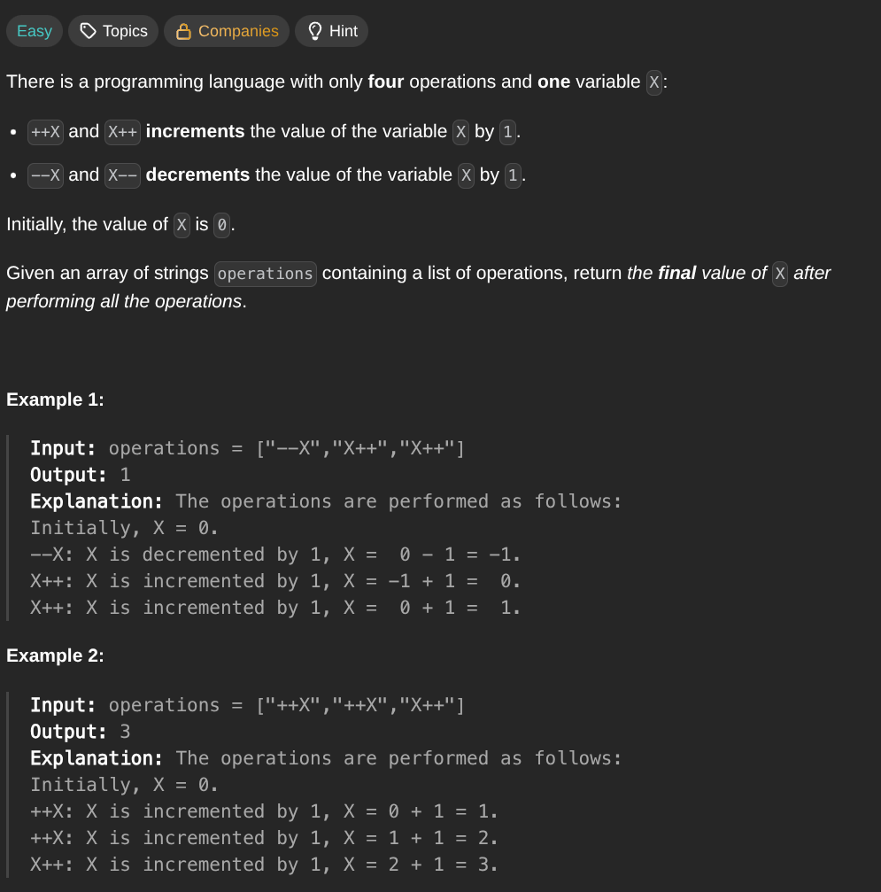

## [Final Value of Variable After Performing Operations](https://leetcode.com/problems/final-value-of-variable-after-perfoming-operations/description/)
### Description:

### Solution:
```Go
func finalValueAfterOperations(operations []string) int {
	result := 0
	
	for _, operation := range operations {
		switch operation[1] {
			case '-': result--
			case '+': result++
		}
	}
	
	return result
}
```
### Time complexity: 
$$ O(n) $$
### Space complexity:
$$ O(1) $$

---
