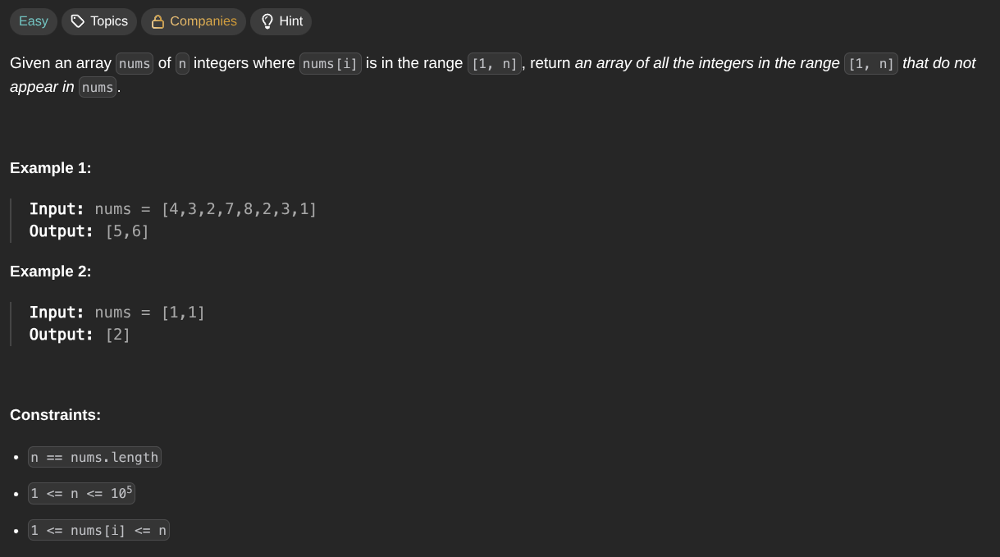

## [Find All Numbers Disappeared in an Array](https://leetcode.com/problems/find-all-numbers-disappeared-in-an-array/description/)
### Description:

### Solution:
```Go
func abs(x int) int {
	if x > 0 { return x }
	return -x
}

func findDisappearedNumbers(nums []int) []int {
	for i := 0; i < len(nums); i++ {
		index := abs(nums[i]) - 1
		if nums[index] > 0 {
			nums[index] = -nums[index]
		}
	}
	
	result := make([]int, 0, len(nums))
	
	for index, num := range nums {
		if num > 0 {
			result = append(result, index+1)
		}
	}
	
	return result
}
```
### Time complexity: 
$$ O(n) $$
### Space complexity:
$$ O(1) $$

---
