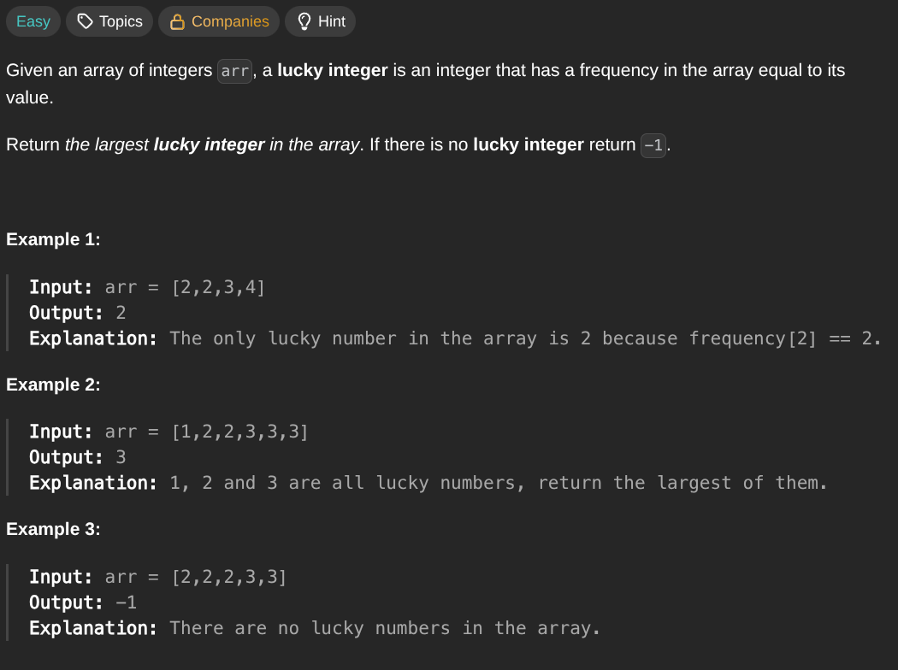

## [Find Lucky Integer in an Array](https://leetcode.com/problems/find-lucky-integer-in-an-array/description/)
### Description:

### Solution:
```Go
func findLucky(nums []int) int {
	seen := make(map[int]int)
	for _, num := range nums {
		seen[num]++
	}
	
	result := -1
	for key, value := range seen {
		if key == value { result = max(result, key) }
	}
	
	return result
}
```
### Time complexity: 
$$ O(n) $$
### Space complexity:
$$ O(n) $$

---
