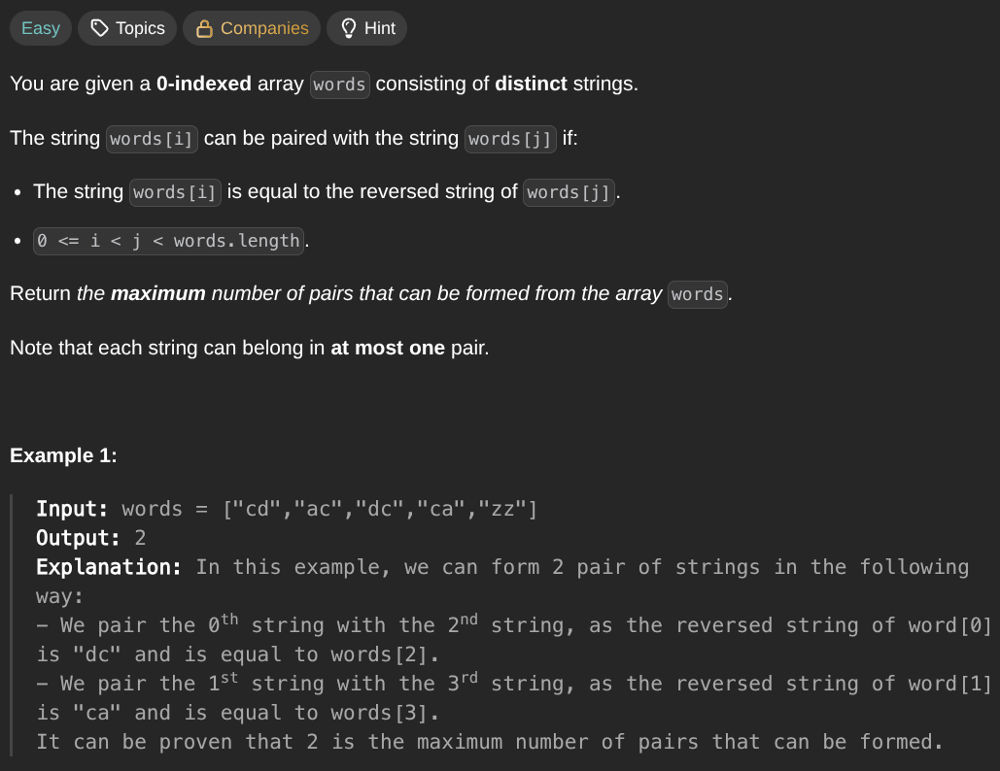

## [Find Maximum Number of String Pairs](https://leetcode.com/problems/find-maximum-number-of-string-pairs/description/)
### Description:

### Solution:
```Go
func maximumNumberOfStringPairs(words []string) int {
	seen := make(map[string]string)
	result := 0
	
	for _, word := range words {
		pair := string(word[1]) + string(word[0])
		if _, ok := seen[pair]; ok {
			result++
		}
		seen[word] = pair
	}
	
	return result
}
```
### Time complexity: 
$$ O(n) $$
### Space complexity:
$$ O(n) $$

---
