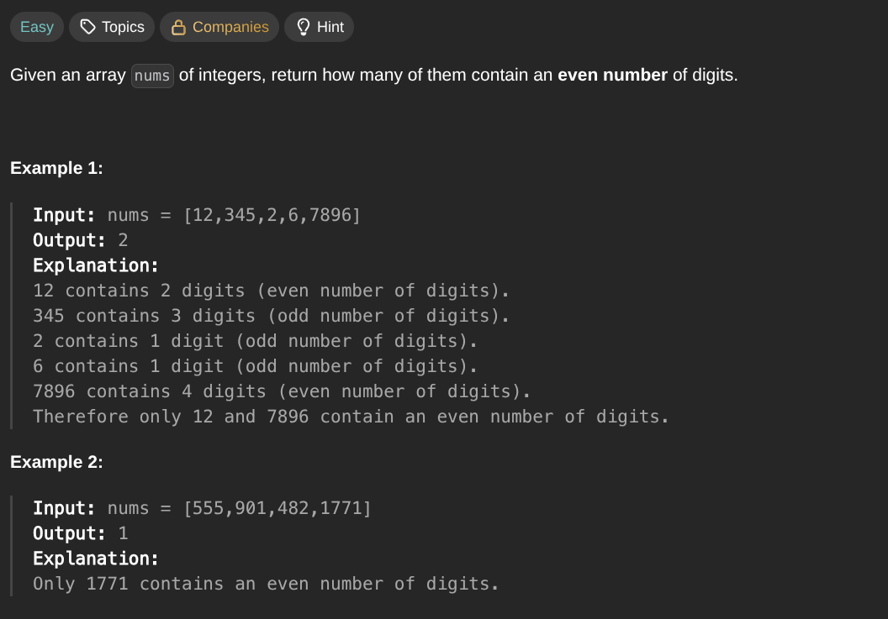

## [Find Numbers with Even Number of Digits](https://leetcode.com/problems/find-numbers-with-even-number-of-digits/description/)
### Description:

### Solution:
```Go
func findNumbers(nums []int) int {
	result := 0
	
	for _, num := range nums {
		if len(strconv.Itoa(num)) % 2 == 0 { result++ }
	}
	
	return result
}
```
### Time complexity: 
$$ O(n) $$
### Space complexity:
$$ O(1) $$

---
