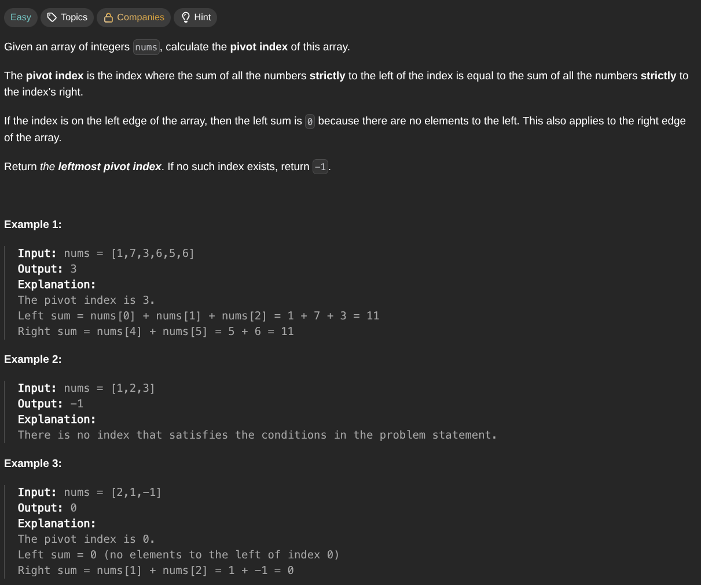

## [Find Pivot Index](https://leetcode.com/problems/find-pivot-index/description/)
### Description:

### Solution:
```Go
func pivotIndex(nums []int) int {
	weightLeft, weightRight := 0, 0
	for _, num := range nums {
		weightRight += num
	}
	
	for index, num := range nums {
		weightRight -= num
		if weightLeft == weightRight { return index }
		weightLeft += num 
	}
	
	return -1
}
```
### Time complexity: 
$$ O(n) $$
### Space complexity:
$$ O(1) $$

---
