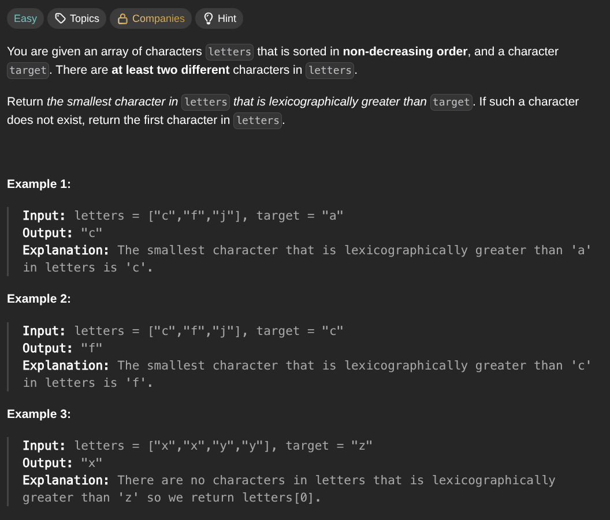

## [Find Smallest Letter Greater Than Target](https://leetcode.com/problems/find-smallest-letter-greater-than-target/description/)
### Description:

### Solution:
```Go
func nextGreatestLetter(letters []byte, target byte) byte {
	result := byte(123)
	
	for _, letter := range letters {
		if letter > target && letter < result {
			result = letter
		}
	}
	
	if result == 123 { return letters[0] }
	return result
}
```
### Time complexity: 
$$ O(n) $$
### Space complexity:
$$ O(1) $$

---
