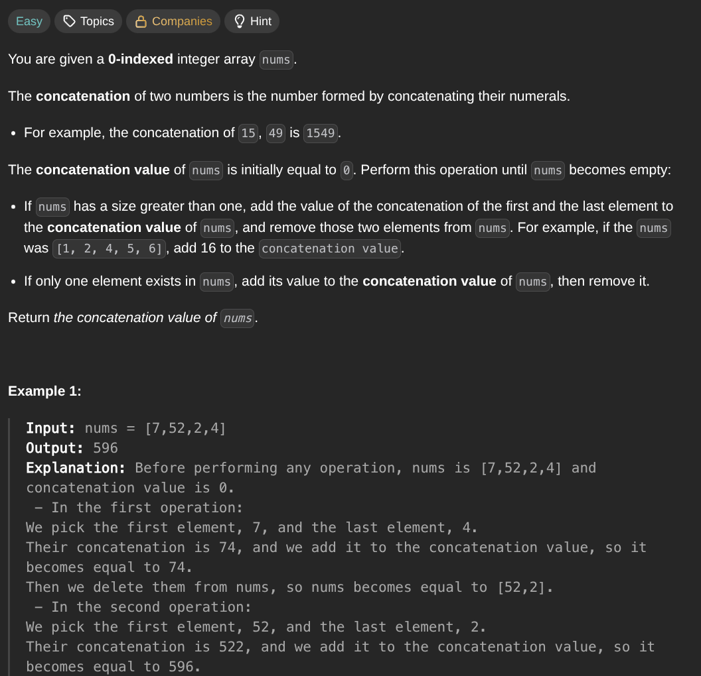

## [Find the Array Concatenation Value](https://leetcode.com/problems/find-the-array-concatenation-value/description/)
### Description:

### Solution:
```Go
func findTheArrayConcVal(nums []int) int64 {
	left, right := 0, len(nums) - 1
	result := 0
	
	for left < right {
		template, _ := strconv.Atoi(strconv.Itoa(nums[left]) + strconv.Itoa(nums[right]))
		result += template
		left++
		right--
	}
	
	if left == right {
		result += nums[left]
	}
	
	return int64(result)
}
```
### Time complexity: 
$$ O(n) $$
### Space complexity:
$$ O(1) $$

---
