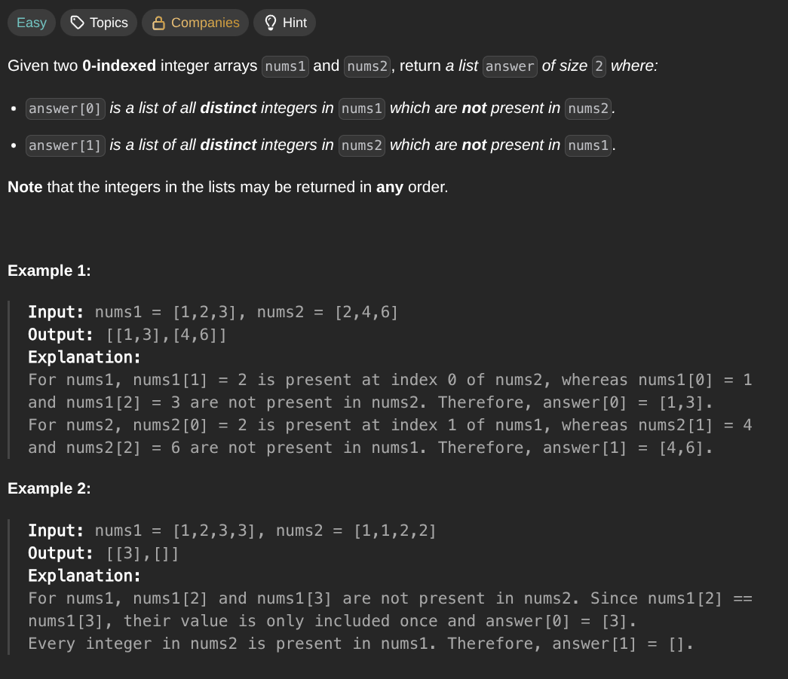

## [Find the Difference of Two Arrays](https://leetcode.com/problems/find-the-difference-of-two-arrays/description/)
### Description:

### Solution:
```Go
func findDifference(nums1, nums2 []int) [][]int {
	seen := make(map[int]bool)
	result := make([][]int, 2)
	
	for _, num1 := range nums1 {
		seen[num1] = true
	}
	
	for _, num2 := range nums2 {
		if _, ok := seen[num2]; !ok {
			result[1] = append(result[1], num2)
		}
		seen[num2] = false
	}
	
	for key, value := range seen {
		if value {
			result[0] = append(result[0], key)
		}
	}
	
	return result
}
```
### Time complexity: 
$$ O(n) $$
### Space complexity:
$$ O(n) $$

---
