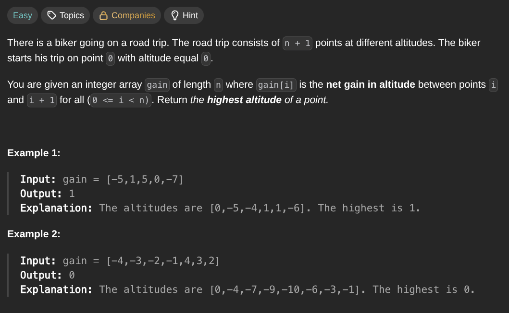

## [Find the Highest Altitude](https://leetcode.com/problems/find-the-highest-altitude/description/)
### Description:

### Solution:
```Go
func largestAltitude(gain []int) int {
	result, template := 0, 0
	
	for _, height := range gain {
		template += height
		result = max(result, template)
	}
	
	return result
}
```
### Time complexity: 
$$ O(n) $$
### Space complexity:
$$ O(1) $$

---