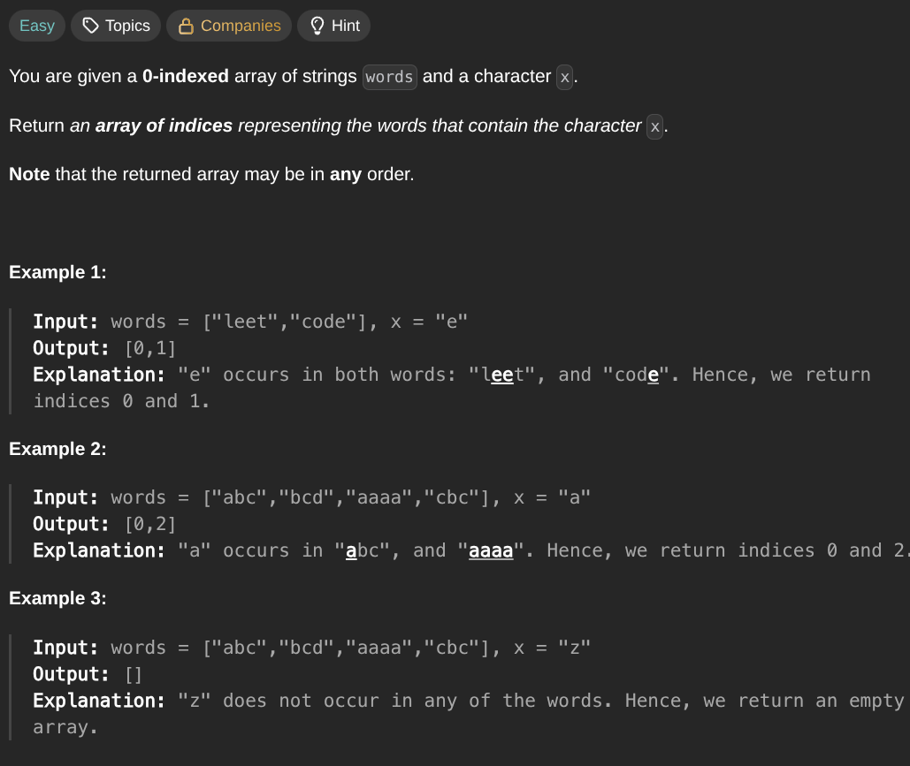

## [Find Words Containing Character](https://leetcode.com/problems/findWordsContainingCharacter/description/)
### Description:

### Solution:
```Go
func findWordsContaining(words []string, x byte) []int {
	result := make([]int, 0, len(words))
	
	for idx, word := range words {
		for i := 0; i < len(word); i++ {
			if word[i] == x { 
				result = append(result, idx)
				break
			}
		}
	}
	
	return result
}
```
### Time complexity: 
$$ O(n) $$
### Space complexity:
$$ O(n) $$

---
