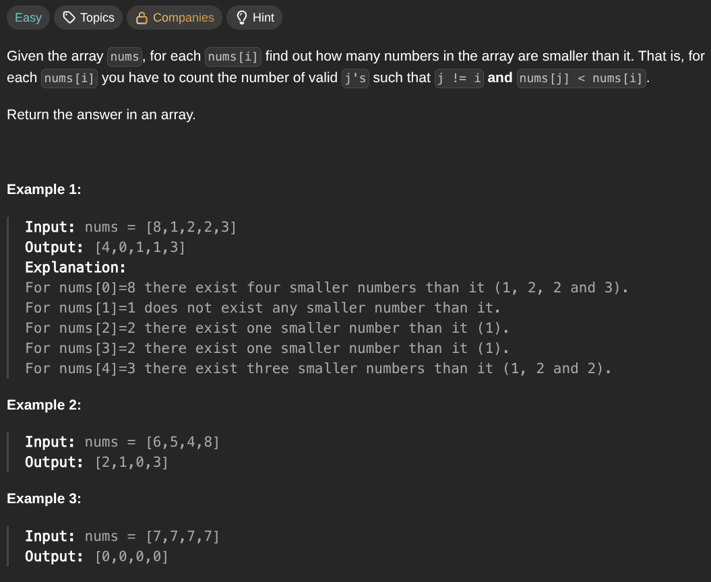

## [How Many Numbers Are Smaller Than the Current Number](https://leetcode.com/problems/how-many-numbers-are-smaller-than-the-current-number/description/)
### Description:

### Solution:
```Go
func smallerNumbersThanCurrent(nums []int) []int {
	prefix, seen := make([]int, 101), make([]int, 101)
	result := make([]int, len(nums))
	
	for _, num := range nums {
		seen[num]++
	}
	
	for i := 1; i < 101; i++ {
		prefix[i] += prefix[i-1] + seen[i-1]
	}
	
	for i := 0; i < len(nums); i++ {
		result[i] = prefix[nums[i]]
	}
	
	return result
}
```
### Time complexity: 
$$ O(n) $$
### Space complexity:
$$ O(n) $$

---
