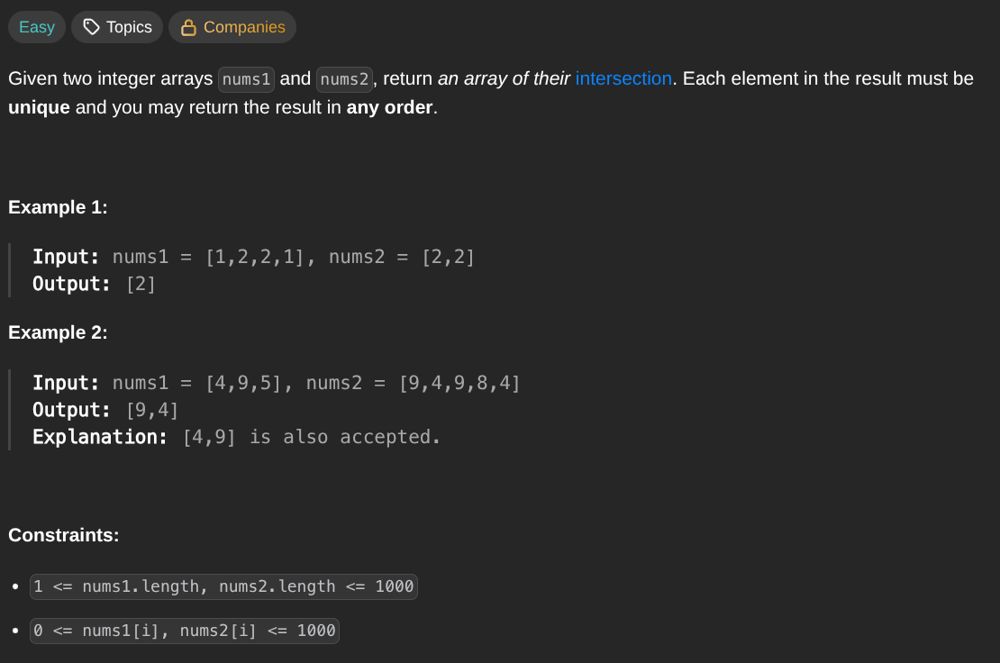

## [Intersection of Two Arrays](https://leetcode.com/problems/intersection-of-two-arrays/description/)
### Description:

### Solution:
```Go
func intersection(nums1, nums2 []int) []int {
	seen := make(map[int]bool)
	result := make([]int, 0, len(nums1))
	
	for _, num := range nums1 {
		seen[num] = true
	}
	
	for _, num := range nums2 {
		if seen[num] {
			result = append(result, num)
			seen[num] = false	
		}
	}
	
	return result
}
```
### Time complexity: 
$$ O(n + m) $$
### Space complexity:
$$ O(min(n, m)) $$

---
