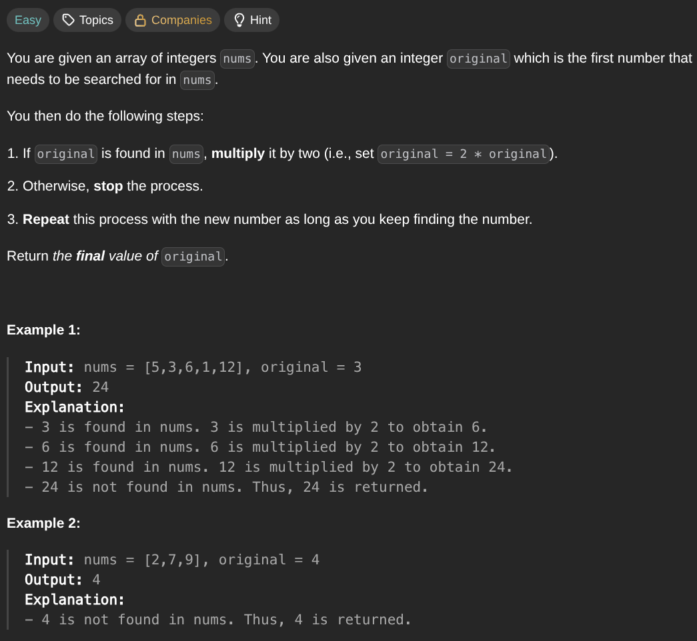

## [Keep Multiplying Found Values by Two](https://leetcode.com/problems/keep-multiplying-found-values-by-two/description/)
### Description:

### Solution:
```Go
func findFinalValue(nums []int, original int) int {
	seen := make(map[int]bool, len(nums))
	
	for _, num := range nums {
		seen[num] = true
	}
	
	for seen[original] {
		original *= 2
	}
	
	return original
}
```
### Time complexity: 
$$ O(n) $$
### Space complexity:
$$ O(n) $$

---
