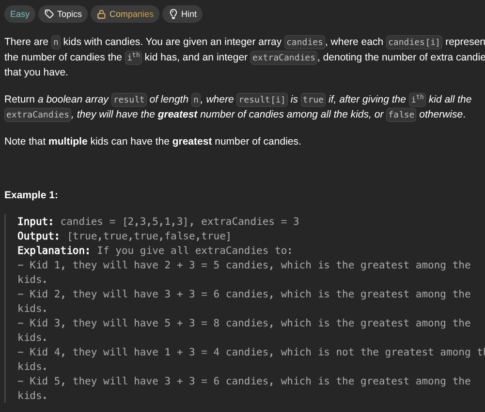

## [Kids With the Greatest Number of Candies](https://leetcode.com/problems/kids-with-the-greatest-number-of-candies/description/)
### Description:

### Solution:
```Go
func kidsWithCandies(candies []int, extraCandies int) []bool {
	result := make([]bool, len(candies))
	bestKid := 0
	for _, kid := range candies {
		bestKid = max(bestKid, kid)
	}
	
	for i, kid := range candies {
		if kid + extraCandies < bestKid {
			result[i] = false
		} else {
			result[i] = true
		}
	}
	
	return result
}
```
### Time complexity: 
$$ O(n) $$
### Space complexity:
$$ O(n) $$

---
