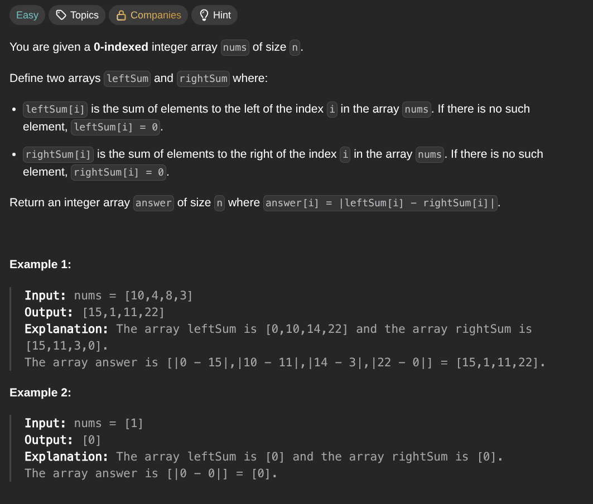

## [Left and Right Sum Differences](https://leetcode.com/problems/left-and-right-sum-differences/)
### Description:

### Solution:
```Go
func abs(x int) int {
	if x < 0 { return -x }
	return x
}

func leftRightDifference(nums []int) []int {
	var leftSum, rightSum int
	result := make([]int, len(nums))
	
	for i := 0; i < len(nums); i++ {
		rightSum += nums[i]
	}
	
	for i := 0; i < len(nums); i++ {
		rightSum -= nums[i]
		result[i] = abs(leftSum - rightSum)
		leftSum += nums[i]
	}
	
	return result
}
```
### Time complexity: 
$$ O(n) $$
### Space complexity:
$$ O(n) $$

---