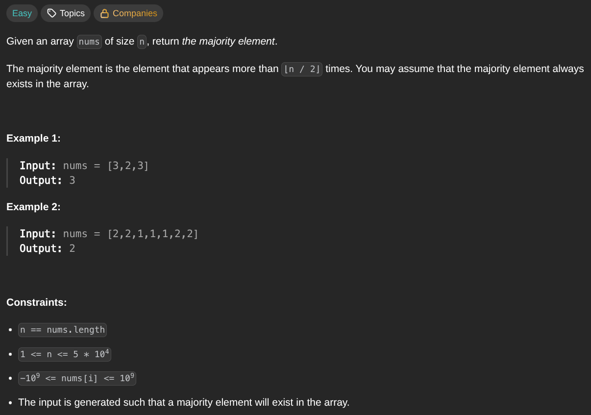

## [Majority Element](https://leetcode.com/problems/majority-element/description/)
### Description:

### Solution:
```Go
func majorityElement(nums []int) int {
	element, elementFreq := nums[0], 1
	
	for i := 1; i < len(nums); i++ {
		if nums[i] == element {
			elementFreq++
		} else {
			elementFreq--
		}
		
		if elementFreq == 0 {
			element, elementFreq = nums[i], 1
		}
	}
	
	return element
}
```
### Time complexity: 
$$ O(n) $$
### Space complexity:
$$ O(1) $$

---
