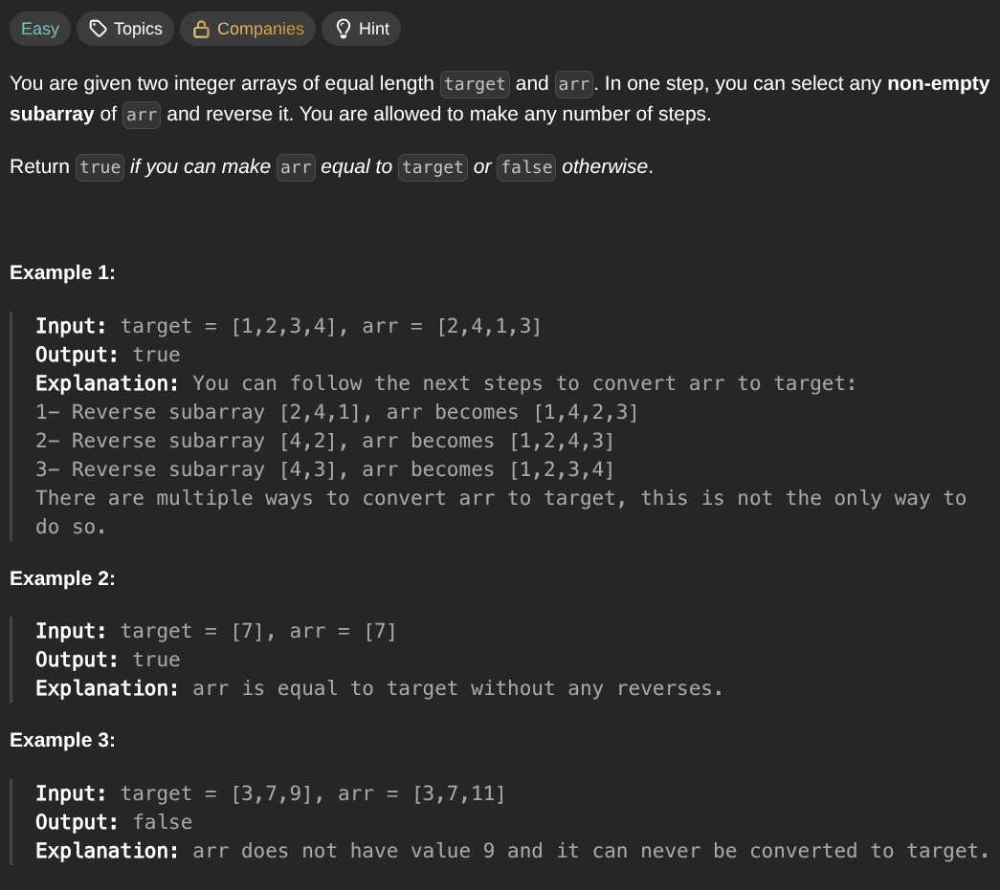

## [Make Two Arrays Equal by Reversing Subarrays](https://leetcode.com/problems/makeTwoArraysEqualByReversingSubArrays/description/)
### Description:

### Solution:
```Go
func canBeEqual(target, arr []int) bool {
	seen := make(map[int]int) 
	
	for i := 0; i < len(target); i++ {
		seen[target[i]]++
		seen[arr[i]]--
	}
	
	for _, value := range seen {
		if value != 0 { return false }
	}
	
	return true
}
```
### Time complexity: 
$$ O(n) $$
### Space complexity:
$$ O(n) $$

---
