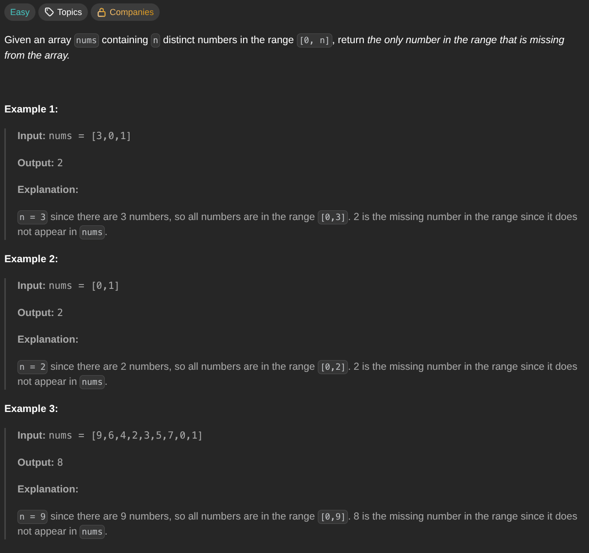

## [Missing Number](https://leetcode.com/problems/missing-number/description/)
### Description:

### Solution:
```Go
func missingNumber(nums []int) int {
	result := (len(nums) * (len(nums) + 1)) / 2
	
	for _, num := range nums {
		result -= num
	}
	
	return result
}
```
### Time complexity: 
$$ O(n) $$
### Space complexity:
$$ O(1) $$

---
