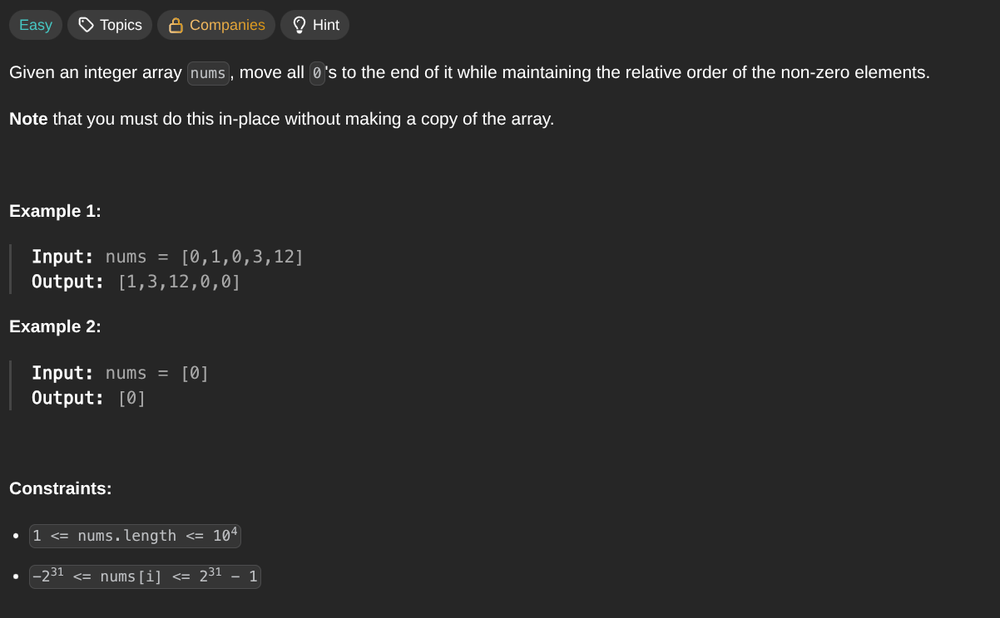

## [Move Zeroes](https://leetcode.com/problems/move-zeroes/description/)
### Description:

### Solution:
```Go
func moveZeroes(nums []int) {
	moved := 0
	
	for i := 0; i < len(nums); i++ {
		if nums[i] != 0 {
			nums[moved], nums[i] = nums[i], nums[moved]
			moved++
		}
	}
	
}
```
### Time complexity: 
$$ O(n) $$
### Space complexity:
$$ O(1) $$

---
