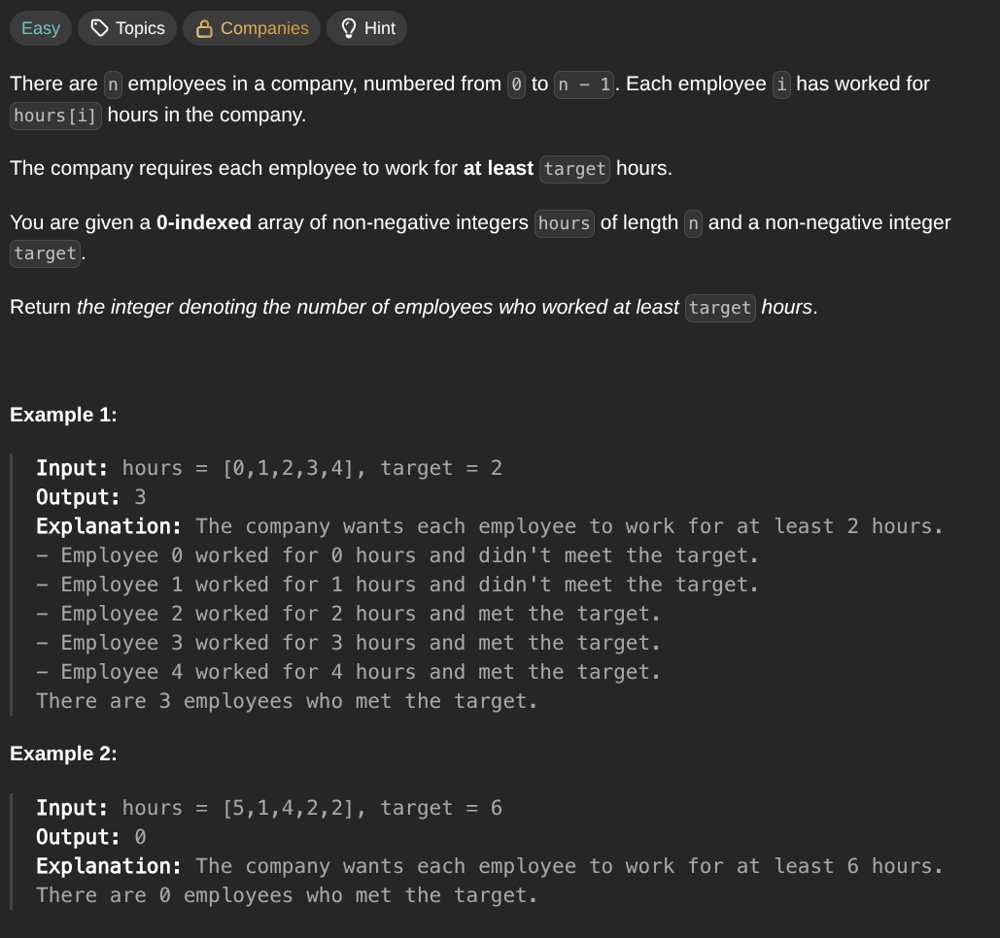

## [Number of Employees Who Met the Target](https://leetcode.com/problems/number-of-employees-who-met-the-target/description/)
### Description:

### Solution:
```Go
func numberOfEmployeesWhoMetTarget(hours []int, target int) int {
	result := 0
	
	for _, hour := range hours {
		if hour >= target { result++ }
	}
	
	return result
}
```
### Time complexity: 
$$ O(n) $$
### Space complexity:
$$ O(1) $$

---
