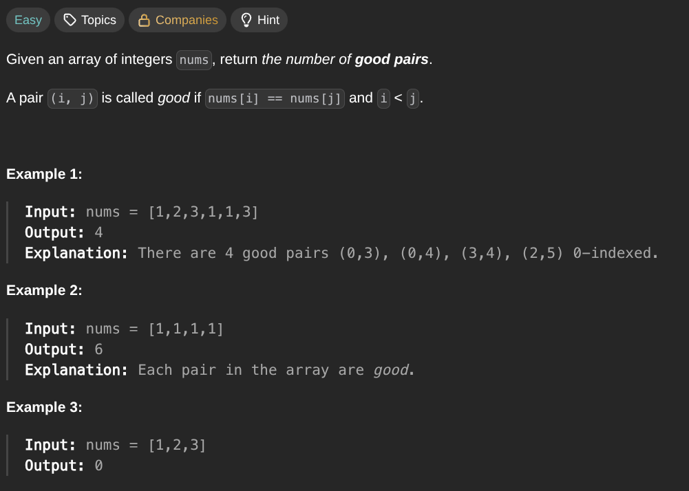

## [Number of Good Pairs](https://leetcode.com/problems/number-of-good-pairs/description/)
### Description:

### Solution:
```Go
func numIdenticalPairs(nums []int) int {
	seen := make(map[int]int)
	result := 0
	for _, num := range nums {
		result += seen[num]
		seen[num]++
	}
	
	return result
}
```
### Time complexity: 
$$ O(n) $$
### Space complexity:
$$ O(n) $$

---
