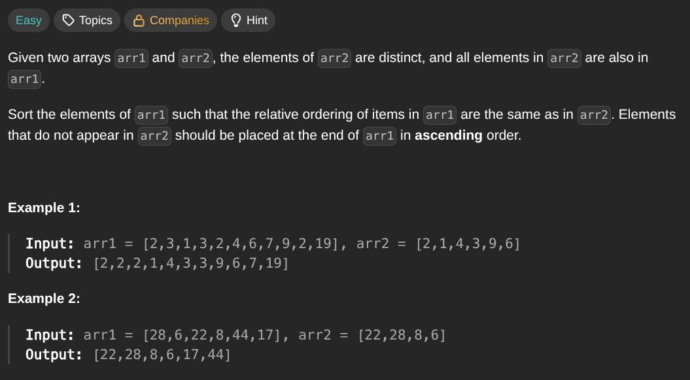

## [Relative Sort Array](https://leetcode.com/problems/relative-sort-array/description/)
### Description:

### Solution:
```Go
func getRank(ranks map[int]int, num int) int {
	if value, ok := ranks[num]; ok {
		return value
	}
	return len(ranks)
}

func relativeSortArray(arr1, arr2 []int) []int {
	seen := make(map[int]int)
	for i, num := range arr2 {
		seen[num] = i
	}
	
	sort.Slice(arr1, func(i, j int) bool {
		rankA, rankB := getRank(seen, arr1[i]), getRank(seen, arr1[j])
		if rankA == rankB { return arr1[i] < arr1[j] }
		return rankA < rankB
	})
	
	return arr1
}
```
### Time complexity: 
$$ O(n \cdot log(n) + k) $$
$$ n = len(arr1) \space;\space k = len(arr2) $$
### Space complexity:
$$ O(k) $$

---
