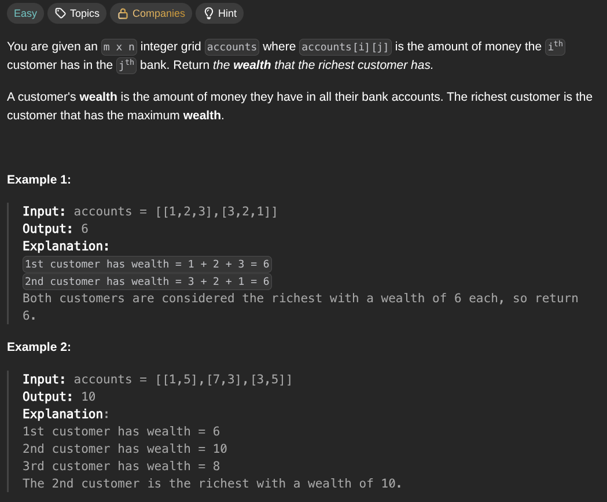

## [Richest Customer Wealth](https://leetcode.com/problems/richest-customer-wealth/description/)
### Description:

### Solution:
```Go
func maximumWealth(accounts [][]int) int {
	result := 0
	for _, account := range accounts {
		template := 0
		for _, money := range account {
			template += money
		}
		result = max(result, template)
	}
	
	return result
}
```
### Time complexity: 
$$ O(n \cdot m) $$
### Space complexity:
$$ O(1) $$

---
