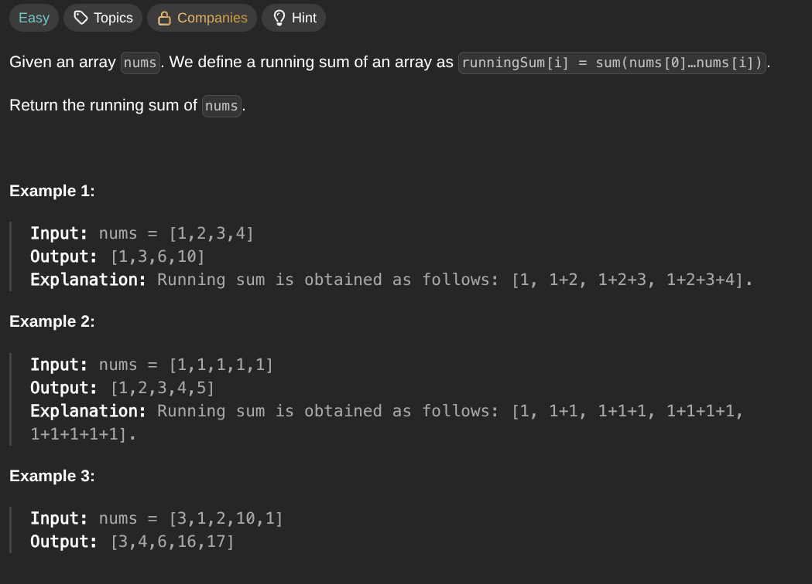

## [Running Sum of 1d Array](https://leetcode.com/problems/running-sum-of-1d-array/description/)
### Description:

### Solution:
```Go
func runningSum(nums []int) []int {
	prefixSum := 0
	
	for i, num := range nums {
		prefixSum += num
		nums[i] = prefixSum
	}
	
	return nums
}
```
### Time complexity: 
$$ O(n) $$
### Space complexity:
$$ O(1) $$

---
