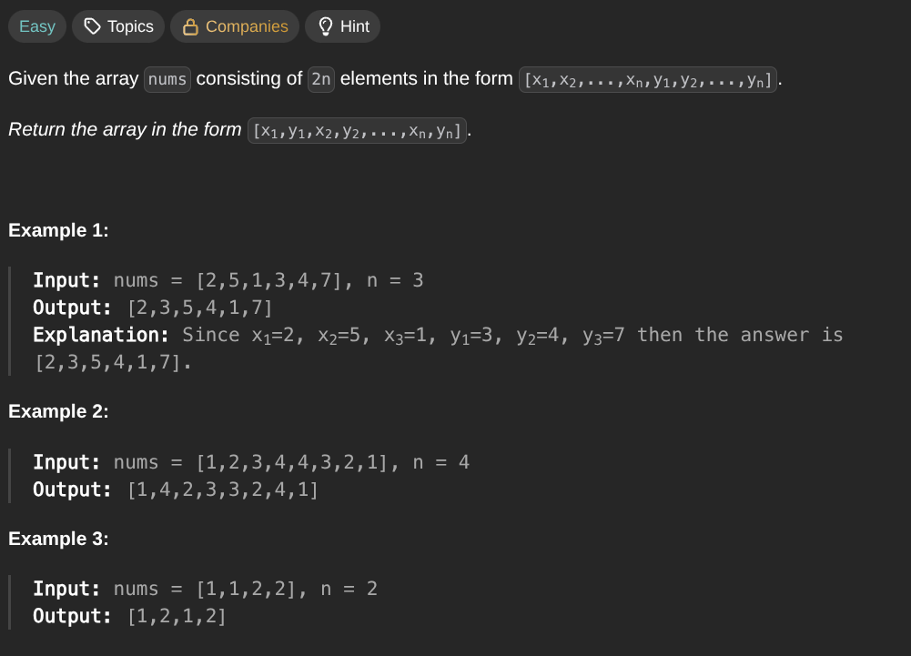

## [Shuffle the Array](https://leetcode.com/problems/shuffle-the-array/description/)
### Description:

### Solution:
```Go
func shuffle(nums []int, n int) []int {
	result := make([]int, 0, len(nums))
	
	for i := 0; i < n; i++ {
		result = append(result, nums[i], nums[i+n])
	}
	
	return result
}
```
### Time complexity: 
$$ O(n) $$
### Space complexity:
$$ O(n) $$

---
