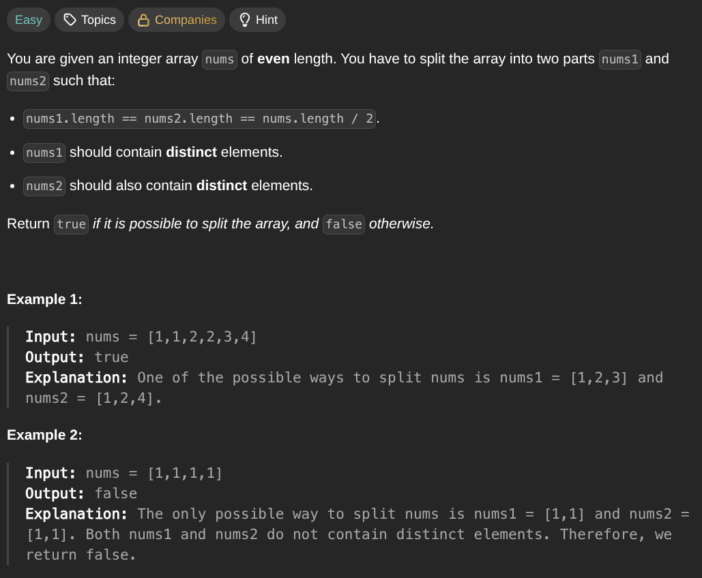

## [Split the Array](https://leetcode.com/problems/split-the-array/description/)
### Description:

### Solution:
```Go
func isPossibleToSplit(nums []int) bool {
	seen := make(map[int]int)
	
	for _, num := range nums {
		seen[num]++
		if seen[num] > 2 { return false }
	}
	
	return true
}
```
### Time complexity: 
$$ O(n) $$
### Space complexity:
$$ O(n) $$

---
