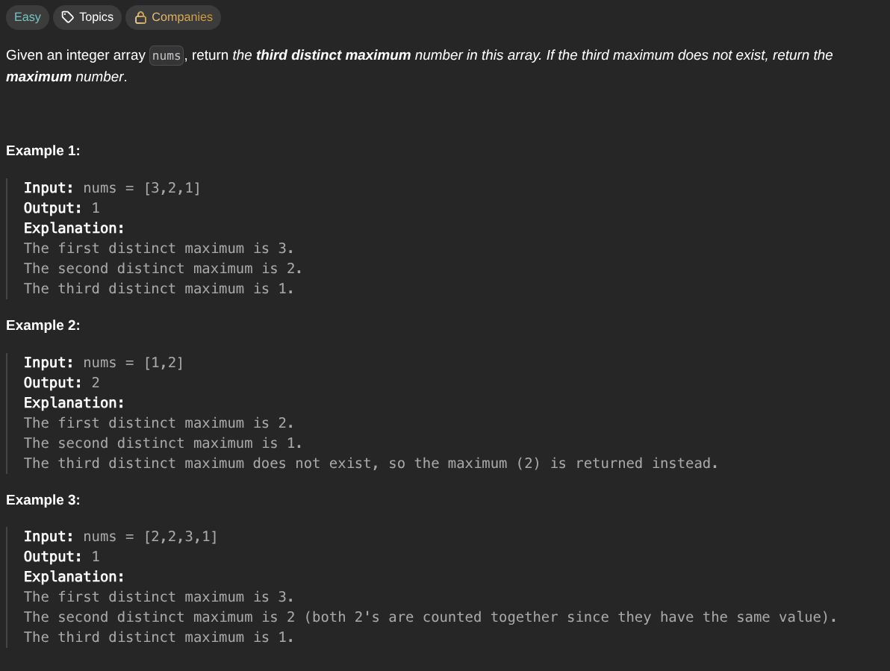

## [Third Maximum Number](https://leetcode.com/problems/third-maximum-number/description/)
### Description:

### Solution:
```Go
func thirdMax(nums []int) int {
	first, second, third := math.MinInt64, math.MinInt64, math.MinInt64
	
	for _, num := range nums {
		if num == first || num == second || num == third {
			continue
		}
		
		switch {
		case num > first:
			first, second, third = num, first, second
		case num > second:
			second, third = num, second
		case num > third:
			third = num
		}
	}
	
	if third == math.MinInt64 { return first }
	return third
}
```
### Time complexity: 
$$ O(n) $$
### Space complexity:
$$ O(1) $$

---
