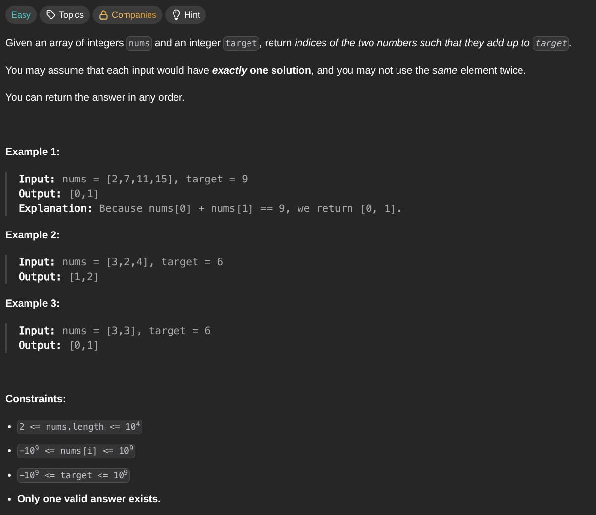

## [Two Sum](https://leetcode.com/problems/two-sum/description/)
### Description:

### Solution:
```Go
func twoSum(nums []int, target int) []int {
	seen := make(map[int]int)
	for i, num := range nums {
		if value, ok := seen[target - num]; ok {
			return []int{i, value}
		} else {
			seen[num] = i
		}
	}
	
	return []int{}
}
```
### Time complexity: 
$$ O(n) $$
### Space complexity:
$$ O(n) $$
---
