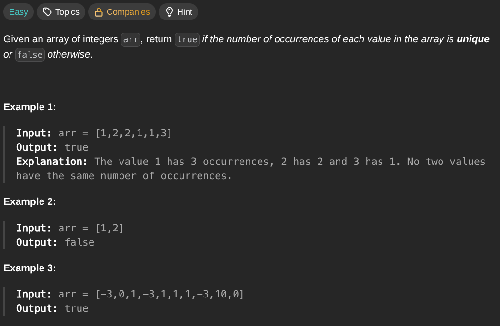

## [Unique Number of Occurrences](https://leetcode.com/problems/unique-number-of-occurrences/description/)
### Description:

### Solution:
```Go
func uniqueOccurrences(nums []int) bool {
	seen := make(map[int]int)
	for _, num := range nums {
		seen[num]++
	}
	
	result := make(map[int]int)
	for key, value := range seen {
		if _, ok := result[value]; ok { return false }
		result[value] = key
	}
	
	return true
}
```
### Time complexity: 
$$ O(n) $$
### Space complexity:
$$ O(n) $$

---
