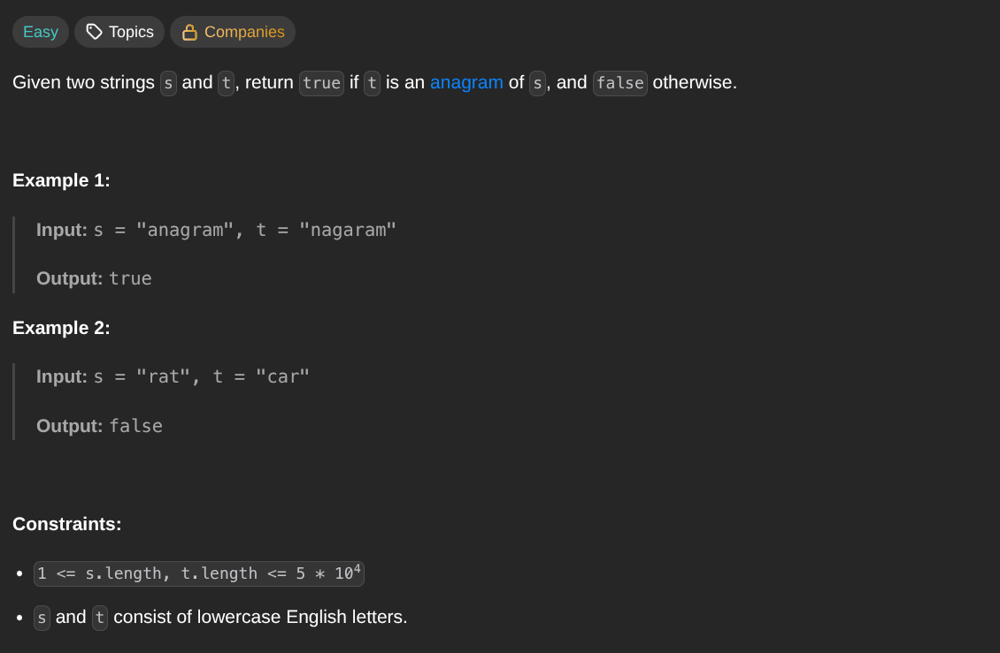

## [Valid Anagram](https://leetcode.com/problems/valid-anagram/description/)
### Description:

### Solution:
```Go
func isAnagram(s, t string) bool {
	if len(s) != len(t) { return false }
	
	var pattern, memory [26]int
	
	for i := 0; i < len(s); i++ {
		pattern[s[i] - 'a']++
		memory[t[i] - 'a']++
	}
	
	return pattern == memory
}
```
### Time complexity: 
$$ O(n) $$
### Space complexity:
$$ O(1) $$

---
