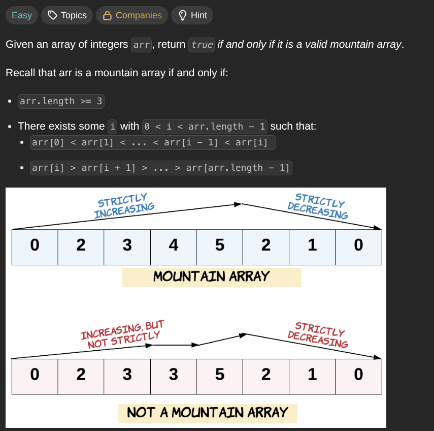

## [Valid Mountain Array](https://leetcode.com/problems/valid-mountain-array/description/)
### Description:

### Solution:
```Go
func validMountainArray(arr []int) bool {
	if len(arr) < 3 { return false }
	
	left, right := 0, len(arr)-1
	for i := 0; i < len(arr); i++ {
		if arr[left] < arr[left+1] { left++ }
		if arr[right] < arr[right-1] { right-- }
		if right == len(arr)-1 || left == 0 { return false }
		if left == right { return true }
	}
	
	return false
}
```
### Time complexity: 
$$ O(n) $$
### Space complexity:
$$ O(1) $$

---